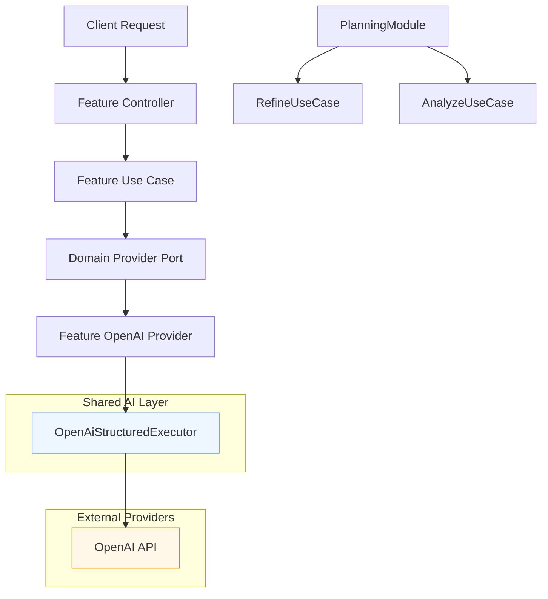

# AI Runtime Diagram

## What This Diagram Shows

- feature modules keep domain ports and use cases explicit
- `OpenAiStructuredExecutor` owns OpenAI structured execution, retry, parsing, and error mapping
- `PlanningModule` stays outside provider orchestration and only composes use cases
