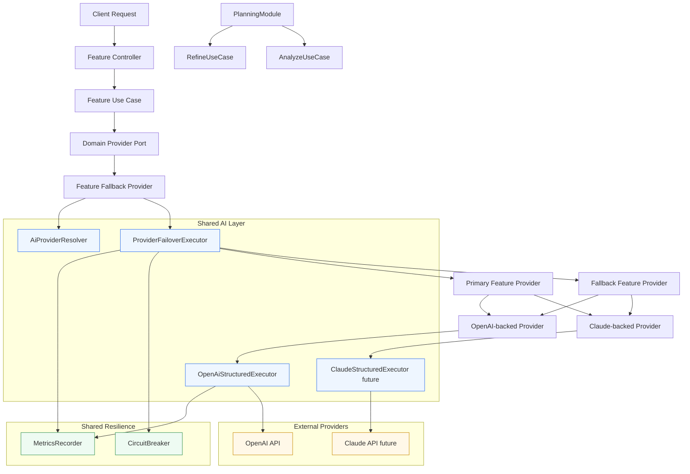

# AI Runtime Diagram

## What This Diagram Shows

- feature modules keep domain ports and use cases explicit
- `AiProviderResolver` decides which provider is primary and which one is fallback
- `ProviderFailoverExecutor` owns failover, circuit breaker checks, and fallback metrics
- `OpenAiStructuredExecutor` owns OpenAI structured execution, retry, parsing, and error mapping
- `PlanningModule` stays outside provider orchestration and only composes use cases
