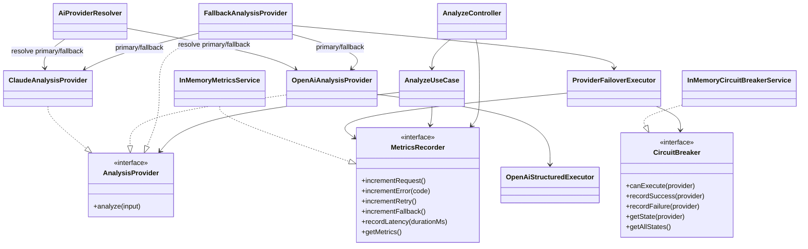

# Analyze Module Class Diagram

```mermaid
classDiagram
    class AnalyzeController
    class AnalyzeUseCase
    class AiProviderResolver
    class OpenAiStructuredExecutor
    class ProviderFailoverExecutor

    class AnalysisProvider {
      <<interface>>
      +analyze(input)
    }

    class FallbackAnalysisProvider
    class OpenAiAnalysisProvider
    class ClaudeAnalysisProvider

    class MetricsRecorder {
      <<interface>>
      +incrementRequest()
      +incrementError(code)
      +incrementRetry()
      +incrementFallback()
      +recordLatency(durationMs)
      +getMetrics()
    }

    class InMemoryMetricsService

    class CircuitBreaker {
      <<interface>>
      +canExecute(provider)
      +recordSuccess(provider)
      +recordFailure(provider)
      +getState(provider)
      +getAllStates()
    }

    class InMemoryCircuitBreakerService

    AnalyzeController --> AnalyzeUseCase
    AnalyzeController --> MetricsRecorder
    AnalyzeUseCase --> AnalysisProvider
    AnalyzeUseCase --> MetricsRecorder

    FallbackAnalysisProvider ..|> AnalysisProvider
    OpenAiAnalysisProvider ..|> AnalysisProvider
    ClaudeAnalysisProvider ..|> AnalysisProvider

    FallbackAnalysisProvider --> OpenAiAnalysisProvider : primary/fallback
    FallbackAnalysisProvider --> ClaudeAnalysisProvider : primary/fallback
    FallbackAnalysisProvider --> ProviderFailoverExecutor
    OpenAiAnalysisProvider --> OpenAiStructuredExecutor
    AiProviderResolver --> OpenAiAnalysisProvider : resolve primary/fallback
    AiProviderResolver --> ClaudeAnalysisProvider : resolve primary/fallback

    ProviderFailoverExecutor --> MetricsRecorder
    ProviderFailoverExecutor --> CircuitBreaker
    InMemoryMetricsService ..|> MetricsRecorder
    InMemoryCircuitBreakerService ..|> CircuitBreaker
```
