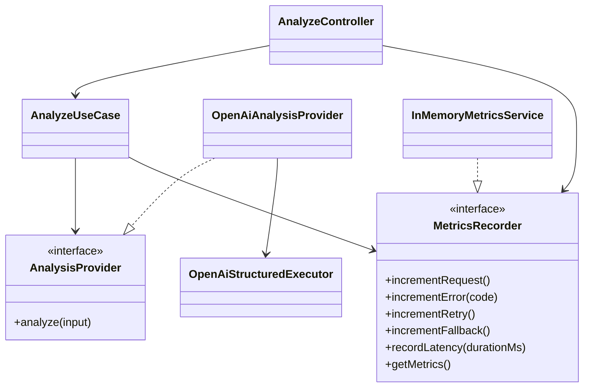

# Analyze Module Class Diagram

```mermaid
classDiagram
    class AnalyzeController
    class AnalyzeUseCase
    class OpenAiStructuredExecutor

    class AnalysisProvider {
      <<interface>>
      +analyze(input)
    }

    class OpenAiAnalysisProvider

    class MetricsRecorder {
      <<interface>>
      +incrementRequest()
      +incrementError(code)
      +incrementRetry()
      +incrementFallback()
      +recordLatency(durationMs)
      +getMetrics()
    }

    class InMemoryMetricsService

    AnalyzeController --> AnalyzeUseCase
    AnalyzeController --> MetricsRecorder
    AnalyzeUseCase --> AnalysisProvider
    AnalyzeUseCase --> MetricsRecorder

    OpenAiAnalysisProvider ..|> AnalysisProvider

    OpenAiAnalysisProvider --> OpenAiStructuredExecutor

    InMemoryMetricsService ..|> MetricsRecorder
```
