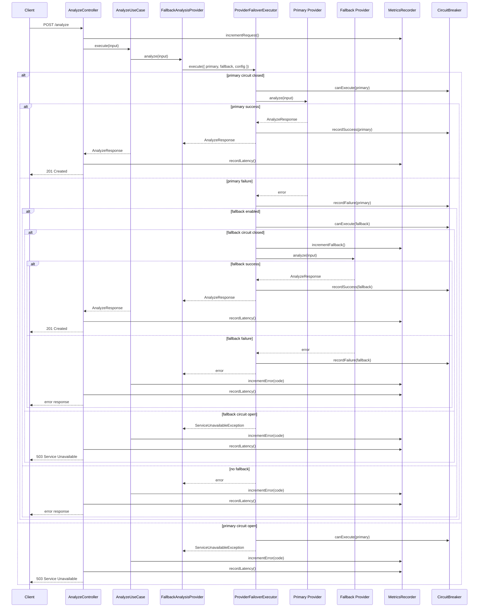

# Analyze Flow Sequence Diagram

```mermaid
sequenceDiagram
    participant Client
    participant Controller as AnalyzeController
    participant UseCase as AnalyzeUseCase
    participant Provider as FallbackAnalysisProvider
    participant Failover as ProviderFailoverExecutor
    participant Primary as Primary Provider
    participant Secondary as Fallback Provider
    participant Metrics as MetricsRecorder
    participant Circuit as CircuitBreaker

    Client->>Controller: POST /analyze
    Controller->>Metrics: incrementRequest()
    Controller->>UseCase: execute(input)

    UseCase->>Provider: analyze(input)
    Provider->>Failover: execute({ primary, fallback, config })

    alt primary circuit closed
        Failover->>Circuit: canExecute(primary)
        Failover->>Primary: analyze(input)

        alt primary success
            Primary-->>Failover: AnalyzeResponse
            Failover->>Circuit: recordSuccess(primary)
            Failover-->>Provider: AnalyzeResponse
            UseCase-->>Controller: AnalyzeResponse
            Controller->>Metrics: recordLatency()
            Controller-->>Client: 201 Created
        else primary failure
            Primary-->>Failover: error
            Failover->>Circuit: recordFailure(primary)

            alt fallback enabled
                Failover->>Circuit: canExecute(fallback)

                alt fallback circuit closed
                    Failover->>Metrics: incrementFallback()
                    Failover->>Secondary: analyze(input)

                    alt fallback success
                        Secondary-->>Failover: AnalyzeResponse
                        Failover->>Circuit: recordSuccess(fallback)
                        Failover-->>Provider: AnalyzeResponse
                        UseCase-->>Controller: AnalyzeResponse
                        Controller->>Metrics: recordLatency()
                        Controller-->>Client: 201 Created
                    else fallback failure
                        Secondary-->>Failover: error
                        Failover->>Circuit: recordFailure(fallback)
                        Failover-->>Provider: error
                        UseCase->>Metrics: incrementError(code)
                        Controller->>Metrics: recordLatency()
                        Controller-->>Client: error response
                    end
                else fallback circuit open
                    Failover-->>Provider: ServiceUnavailableException
                    UseCase->>Metrics: incrementError(code)
                    Controller->>Metrics: recordLatency()
                    Controller-->>Client: 503 Service Unavailable
                end
            else no fallback
                Failover-->>Provider: error
                UseCase->>Metrics: incrementError(code)
                Controller->>Metrics: recordLatency()
                Controller-->>Client: error response
            end
        end
    else primary circuit open
        Failover->>Circuit: canExecute(primary)
        Failover-->>Provider: ServiceUnavailableException
        UseCase->>Metrics: incrementError(code)
        Controller->>Metrics: recordLatency()
        Controller-->>Client: 503 Service Unavailable
    end
```
