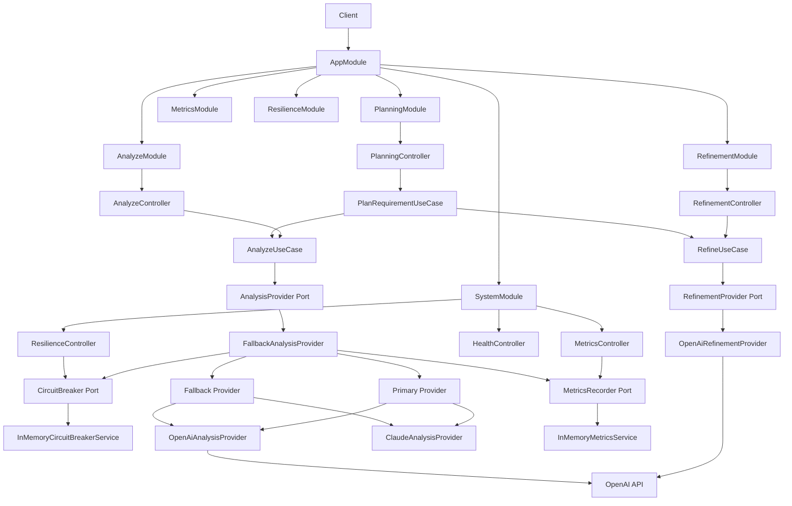

# Architecture Overview Diagram

```mermaid
flowchart TD
    Client[Client] --> App[AppModule]

    App --> AnalyzeModule[AnalyzeModule]
    App --> RefinementModule[RefinementModule]
    App --> PlanningModule[PlanningModule]
    App --> SystemModule[SystemModule]
    App --> MetricsModule[MetricsModule]
    App --> ResilienceModule[ResilienceModule]

    AnalyzeModule --> AnalyzeController[AnalyzeController]
    AnalyzeController --> AnalyzeUseCase[AnalyzeUseCase]
    AnalyzeUseCase --> AnalysisProvider[AnalysisProvider Port]

    RefinementModule --> RefinementController[RefinementController]
    RefinementController --> RefineUseCase[RefineUseCase]
    RefineUseCase --> RefinementProvider[RefinementProvider Port]
    RefinementProvider --> OpenAiRefinementProvider[OpenAiRefinementProvider]
    OpenAiRefinementProvider --> OpenAI

    PlanningModule --> PlanningController[PlanningController]
    PlanningController --> PlanUseCase[PlanRequirementUseCase]
    PlanUseCase --> RefineUseCase
    PlanUseCase --> AnalyzeUseCase

    AnalysisProvider --> FallbackProvider[FallbackAnalysisProvider]

    FallbackProvider --> CircuitBreaker[CircuitBreaker Port]
    CircuitBreaker --> InMemoryCircuitBreaker[InMemoryCircuitBreakerService]

    FallbackProvider --> PrimaryProvider[Primary Provider]
    FallbackProvider --> SecondaryProvider[Fallback Provider]

    PrimaryProvider --> OpenAIProvider[OpenAiAnalysisProvider]
    PrimaryProvider --> ClaudeProvider[ClaudeAnalysisProvider]

    SecondaryProvider --> OpenAIProvider
    SecondaryProvider --> ClaudeProvider

    OpenAIProvider --> OpenAI[OpenAI API]

    SystemModule --> HealthController[HealthController]
    SystemModule --> MetricsController[MetricsController]
    SystemModule --> ResilienceController[ResilienceController]

    MetricsController --> MetricsRecorder[MetricsRecorder Port]
    MetricsRecorder --> InMemoryMetrics[InMemoryMetricsService]

    ResilienceController --> CircuitBreaker
    FallbackProvider --> MetricsRecorder
```