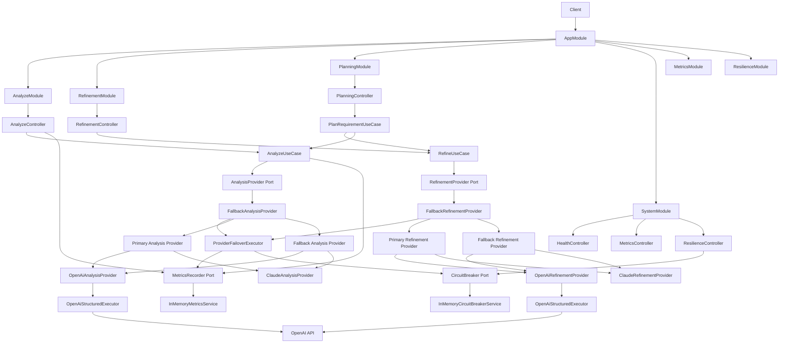

# Architecture Overview Diagram

```mermaid
flowchart TD
    Client[Client] --> App[AppModule]

    App --> AnalyzeModule[AnalyzeModule]
    App --> RefinementModule[RefinementModule]
    App --> PlanningModule[PlanningModule]
    App --> SystemModule[SystemModule]
    App --> MetricsModule[MetricsModule]
    App --> ResilienceModule[ResilienceModule]

    AnalyzeModule --> AnalyzeController[AnalyzeController]
    AnalyzeController --> AnalyzeUseCase[AnalyzeUseCase]
    AnalyzeUseCase --> AnalysisProvider[AnalysisProvider Port]
    AnalyzeController --> MetricsRecorder[MetricsRecorder Port]
    AnalyzeUseCase --> MetricsRecorder
    AnalysisProvider --> AnalyzeFallbackProvider[FallbackAnalysisProvider]
    AnalyzeFallbackProvider --> FailoverExecutor[ProviderFailoverExecutor]
    AnalyzeFallbackProvider --> AnalyzePrimary[Primary Analysis Provider]
    AnalyzeFallbackProvider --> AnalyzeFallback[Fallback Analysis Provider]
    AnalyzePrimary --> OpenAIProvider[OpenAiAnalysisProvider]
    AnalyzePrimary --> ClaudeProvider[ClaudeAnalysisProvider]
    AnalyzeFallback --> OpenAIProvider
    AnalyzeFallback --> ClaudeProvider
    OpenAIProvider --> AnalyzeExecutor[OpenAiStructuredExecutor]
    AnalyzeExecutor --> OpenAI[OpenAI API]

    RefinementModule --> RefinementController[RefinementController]
    RefinementController --> RefineUseCase[RefineUseCase]
    RefineUseCase --> RefinementProvider[RefinementProvider Port]
    RefinementProvider --> RefinementFallbackProvider[FallbackRefinementProvider]
    RefinementFallbackProvider --> FailoverExecutor
    RefinementFallbackProvider --> RefinementPrimary[Primary Refinement Provider]
    RefinementFallbackProvider --> RefinementFallback[Fallback Refinement Provider]
    RefinementPrimary --> OpenAiRefinementProvider[OpenAiRefinementProvider]
    RefinementPrimary --> ClaudeRefinementProvider[ClaudeRefinementProvider]
    RefinementFallback --> OpenAiRefinementProvider
    RefinementFallback --> ClaudeRefinementProvider
    OpenAiRefinementProvider --> RefinementExecutor[OpenAiStructuredExecutor]
    RefinementExecutor --> OpenAI

    PlanningModule --> PlanningController[PlanningController]
    PlanningController --> PlanUseCase[PlanRequirementUseCase]
    PlanUseCase --> RefineUseCase
    PlanUseCase --> AnalyzeUseCase

    SystemModule --> HealthController[HealthController]
    SystemModule --> MetricsController[MetricsController]
    SystemModule --> ResilienceController[ResilienceController]

    MetricsRecorder --> InMemoryMetrics[InMemoryMetricsService]
    ResilienceController --> CircuitBreaker[CircuitBreaker Port]
    CircuitBreaker --> InMemoryCircuitBreaker[InMemoryCircuitBreakerService]
    FailoverExecutor --> MetricsRecorder
    FailoverExecutor --> CircuitBreaker
```
