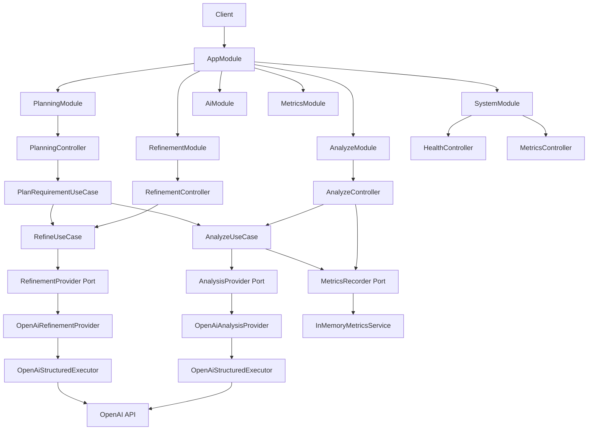

# Architecture Overview Diagram

```mermaid
flowchart TD
    Client[Client] --> App[AppModule]

    App --> AnalyzeModule[AnalyzeModule]
    App --> RefinementModule[RefinementModule]
    App --> PlanningModule[PlanningModule]
    App --> SystemModule[SystemModule]
    App --> AiModule[AiModule]
    App --> MetricsModule[MetricsModule]

    AnalyzeModule --> AnalyzeController[AnalyzeController]
    AnalyzeController --> AnalyzeUseCase[AnalyzeUseCase]
    AnalyzeUseCase --> AnalysisProvider[AnalysisProvider Port]
    AnalyzeController --> MetricsRecorder[MetricsRecorder Port]
    AnalyzeUseCase --> MetricsRecorder
    AnalysisProvider --> OpenAIProvider[OpenAiAnalysisProvider]
    OpenAIProvider --> AnalyzeExecutor[OpenAiStructuredExecutor]
    AnalyzeExecutor --> OpenAI[OpenAI API]

    RefinementModule --> RefinementController[RefinementController]
    RefinementController --> RefineUseCase[RefineUseCase]
    RefineUseCase --> RefinementProvider[RefinementProvider Port]
    RefinementProvider --> OpenAiRefinementProvider[OpenAiRefinementProvider]
    OpenAiRefinementProvider --> RefinementExecutor[OpenAiStructuredExecutor]
    RefinementExecutor --> OpenAI

    PlanningModule --> PlanningController[PlanningController]
    PlanningController --> PlanUseCase[PlanRequirementUseCase]
    PlanUseCase --> RefineUseCase
    PlanUseCase --> AnalyzeUseCase

    SystemModule --> HealthController[HealthController]
    SystemModule --> MetricsController[MetricsController]

    MetricsRecorder --> InMemoryMetrics[InMemoryMetricsService]
```
