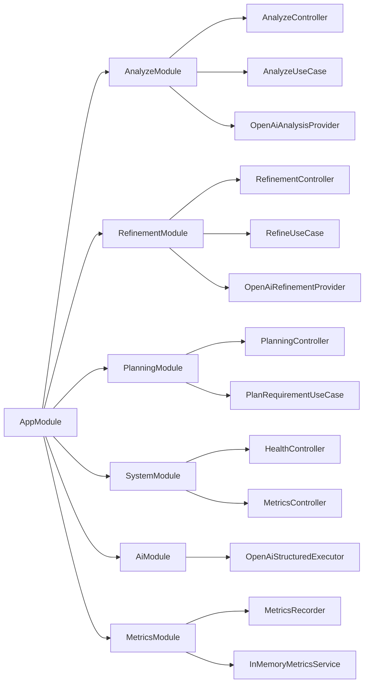

# Module Diagram

```mermaid
flowchart LR
    AppModule --> AnalyzeModule
    AppModule --> RefinementModule
    AppModule --> PlanningModule
    AppModule --> SystemModule
    AppModule --> AiModule
    AppModule --> MetricsModule

    AnalyzeModule --> AnalyzeController
    AnalyzeModule --> AnalyzeUseCase
    AnalyzeModule --> OpenAiAnalysisProvider

    RefinementModule --> RefinementController
    RefinementModule --> RefineUseCase
    RefinementModule --> OpenAiRefinementProvider

    AiModule --> OpenAiStructuredExecutor

    PlanningModule --> PlanningController
    PlanningModule --> PlanRequirementUseCase

    SystemModule --> HealthController
    SystemModule --> MetricsController

    MetricsModule --> MetricsRecorder
    MetricsModule --> InMemoryMetricsService
```
