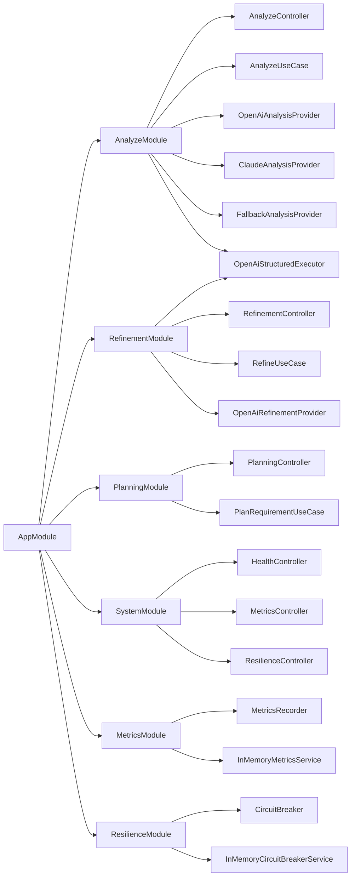

# Module Diagram

```mermaid
flowchart LR
    AppModule --> AnalyzeModule
    AppModule --> RefinementModule
    AppModule --> PlanningModule
    AppModule --> SystemModule
    AppModule --> MetricsModule
    AppModule --> ResilienceModule

    AnalyzeModule --> AnalyzeController
    AnalyzeModule --> AnalyzeUseCase
    AnalyzeModule --> OpenAiAnalysisProvider
    AnalyzeModule --> ClaudeAnalysisProvider
    AnalyzeModule --> FallbackAnalysisProvider
    AnalyzeModule --> OpenAiStructuredExecutor

    RefinementModule --> RefinementController
    RefinementModule --> RefineUseCase
    RefinementModule --> OpenAiRefinementProvider
    RefinementModule --> OpenAiStructuredExecutor

    PlanningModule --> PlanningController
    PlanningModule --> PlanRequirementUseCase

    SystemModule --> HealthController
    SystemModule --> MetricsController
    SystemModule --> ResilienceController

    MetricsModule --> MetricsRecorder
    MetricsModule --> InMemoryMetricsService

    ResilienceModule --> CircuitBreaker
    ResilienceModule --> InMemoryCircuitBreakerService
```
