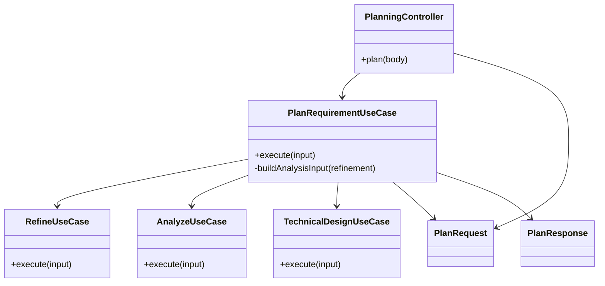

# Planning Module Class Diagram

```mermaid
classDiagram
    class PlanningController {
      +plan(body)
    }

    class PlanRequirementUseCase {
      +execute(input)
      -buildAnalysisInput(refinement)
    }

    class RefineUseCase {
      +execute(input)
    }

    class AnalyzeUseCase {
      +execute(input)
    }

    class TechnicalDesignUseCase {
      +execute(input)
    }

    class PlanRequest
    class PlanResponse

    PlanningController --> PlanRequirementUseCase
    PlanRequirementUseCase --> RefineUseCase
    PlanRequirementUseCase --> AnalyzeUseCase
    PlanRequirementUseCase --> TechnicalDesignUseCase

    PlanningController --> PlanRequest
    PlanRequirementUseCase --> PlanRequest
    PlanRequirementUseCase --> PlanResponse
```
