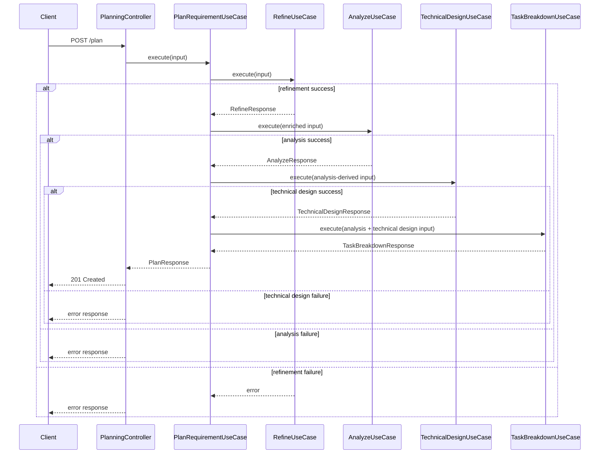

# Planning Flow Sequence Diagram

```mermaid
sequenceDiagram
    participant Client
    participant Controller as PlanningController
    participant UseCase as PlanRequirementUseCase
    participant Refine as RefineUseCase
    participant Analyze as AnalyzeUseCase
    participant Design as TechnicalDesignUseCase
    participant Breakdown as TaskBreakdownUseCase

    Client->>Controller: POST /plan
    Controller->>UseCase: execute(input)

    UseCase->>Refine: execute(input)

    alt refinement success
        Refine-->>UseCase: RefineResponse
        UseCase->>Analyze: execute(enriched input)

        alt analysis success
            Analyze-->>UseCase: AnalyzeResponse
            UseCase->>Design: execute(analysis-derived input)
            alt technical design success
                Design-->>UseCase: TechnicalDesignResponse
                UseCase->>Breakdown: execute(analysis + technical design input)
                Breakdown-->>UseCase: TaskBreakdownResponse
                UseCase-->>Controller: PlanResponse
                Controller-->>Client: 201 Created
            else technical design failure
                Controller-->>Client: error response
            end
        else analysis failure
            Controller-->>Client: error response
        end
    else refinement failure
        Refine-->>UseCase: error
        Controller-->>Client: error response
    end
```
