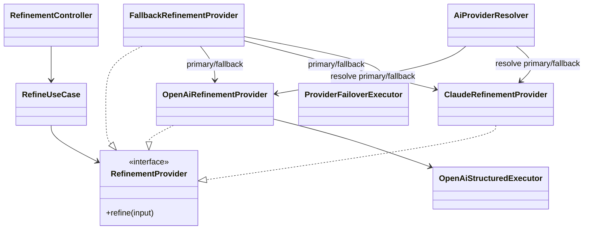

# Refinement Module Class Diagram

```mermaid
classDiagram
    class RefinementController
    class RefineUseCase
    class AiProviderResolver
    class OpenAiStructuredExecutor
    class ProviderFailoverExecutor

    class RefinementProvider {
      <<interface>>
      +refine(input)
    }

    class OpenAiRefinementProvider
    class ClaudeRefinementProvider
    class FallbackRefinementProvider

    RefinementController --> RefineUseCase
    RefineUseCase --> RefinementProvider

    OpenAiRefinementProvider ..|> RefinementProvider
    ClaudeRefinementProvider ..|> RefinementProvider
    FallbackRefinementProvider ..|> RefinementProvider

    OpenAiRefinementProvider --> OpenAiStructuredExecutor
    FallbackRefinementProvider --> OpenAiRefinementProvider : primary/fallback
    FallbackRefinementProvider --> ClaudeRefinementProvider : primary/fallback
    FallbackRefinementProvider --> ProviderFailoverExecutor
    AiProviderResolver --> OpenAiRefinementProvider : resolve primary/fallback
    AiProviderResolver --> ClaudeRefinementProvider : resolve primary/fallback
```
