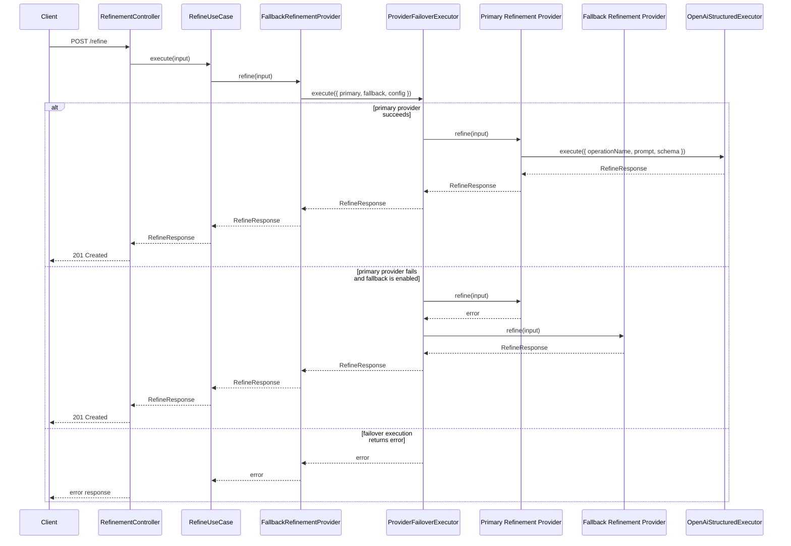

# Refine Flow Sequence Diagram

```mermaid
sequenceDiagram
    participant Client
    participant Controller as RefinementController
    participant UseCase as RefineUseCase
    participant Provider as FallbackRefinementProvider
    participant Failover as ProviderFailoverExecutor
    participant Primary as Primary Refinement Provider
    participant Fallback as Fallback Refinement Provider
    participant Executor as OpenAiStructuredExecutor

    Client->>Controller: POST /refine
    Controller->>UseCase: execute(input)

    UseCase->>Provider: refine(input)
    Provider->>Failover: execute({ primary, fallback, config })

    alt primary provider succeeds
        Failover->>Primary: refine(input)
        Primary->>Executor: execute({ operationName, prompt, schema })
        Executor-->>Primary: RefineResponse
        Primary-->>Failover: RefineResponse
        Failover-->>Provider: RefineResponse
        Provider-->>UseCase: RefineResponse
        UseCase-->>Controller: RefineResponse
        Controller-->>Client: 201 Created
    else primary provider fails and fallback is enabled
        Failover->>Primary: refine(input)
        Primary-->>Failover: error
        Failover->>Fallback: refine(input)
        Fallback-->>Failover: RefineResponse
        Failover-->>Provider: RefineResponse
        Provider-->>UseCase: RefineResponse
        UseCase-->>Controller: RefineResponse
        Controller-->>Client: 201 Created
    else failover execution returns error
        Failover-->>Provider: error
        Provider-->>UseCase: error
        Controller-->>Client: error response
    end
```
