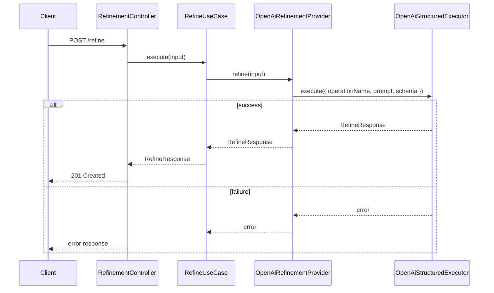

# Refine Flow Sequence Diagram

```mermaid
sequenceDiagram
    participant Client
    participant Controller as RefinementController
    participant UseCase as RefineUseCase
    participant Provider as OpenAiRefinementProvider
    participant Executor as OpenAiStructuredExecutor

    Client->>Controller: POST /refine
    Controller->>UseCase: execute(input)

    UseCase->>Provider: refine(input)
    Provider->>Executor: execute({ operationName, prompt, schema })

    alt success
        Executor-->>Provider: RefineResponse
        Provider-->>UseCase: RefineResponse
        UseCase-->>Controller: RefineResponse
        Controller-->>Client: 201 Created
    else failure
        Executor-->>Provider: error
        Provider-->>UseCase: error
        Controller-->>Client: error response
    end
```
